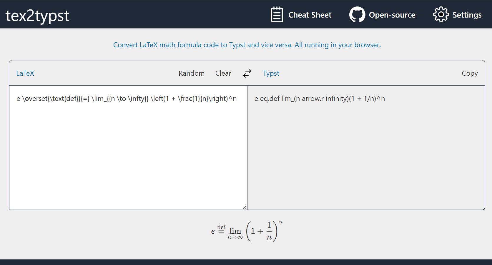

# tex2typst-webapp

Translate LaTeX or TeX math markup to typst in your browser.

Demo screenshot:



This project is a Web UI wrapper. The core algorithm is implemented in [qwinsi/tex2typst](https://github.com/qwinsi/tex2typst).

## Trying Online

A static web App is deployed on [Github page](https://qwinsi.github.io/tex2typst-webapp/).

## Developing

This project is developed with Vue 3 in [Vite](https://vitejs.dev/). So the development steps follow the general paradigm of Vite.

### Project Setup

```sh
npm install
```

### Compile and Hot-Reload for Development

```sh
npm run dev
```

### Compile and Minify for Production

```sh
npm run build
```
