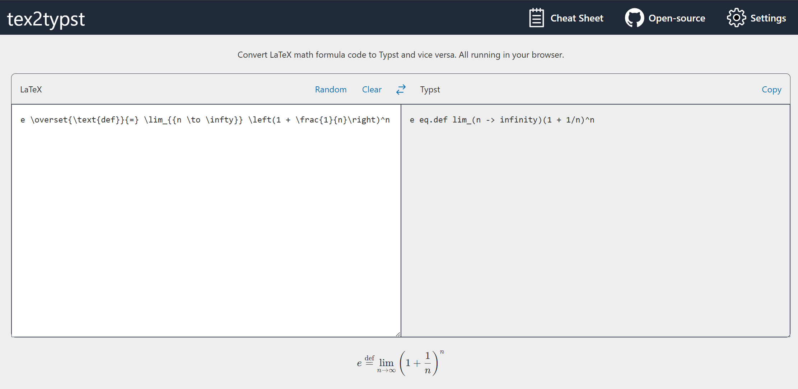

# tex2typst-webapp

Translate between LaTeX / TeX math markup and Typst in your browser.

Demo screenshot:



This project is a Web UI wrapper. The core algorithm is implemented in [qwinsi/tex2typst](https://github.com/qwinsi/tex2typst).

## Trying Online

A static web App is hosted on the [Github Pages](https://qwinsi.github.io/tex2typst-webapp/).

## Development

### Installing Dependencies and Running

```sh
npm install
npm run prepare-project # Don't omit this!
npm run dev
```

### Building

```sh
npm run build
```

## Open-source License

GPL v3. See [LICENSE](./LICENSE) for details.
